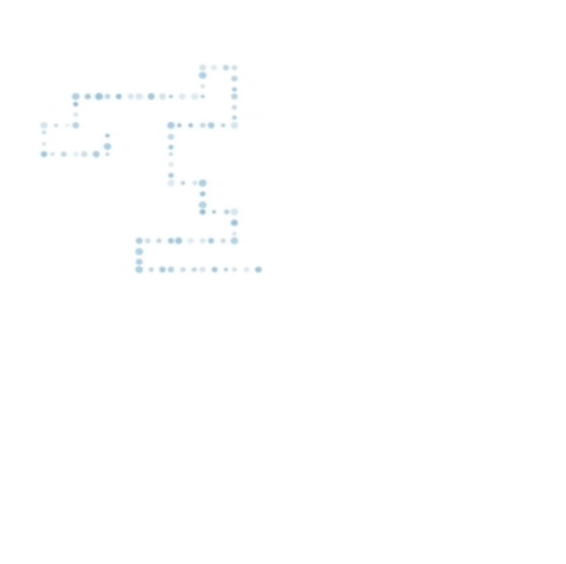

---
 
 
 

Importing & Building
====================

You can run the project from terminal using `gradle build`

Import into [IntelliJ](https://www.jetbrains.com/idea/) using Import Project > build.gradle and follow the steps to import as a Gradle project. Run using a Gradle run configuration which executes `run`.
