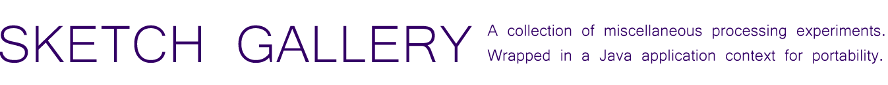
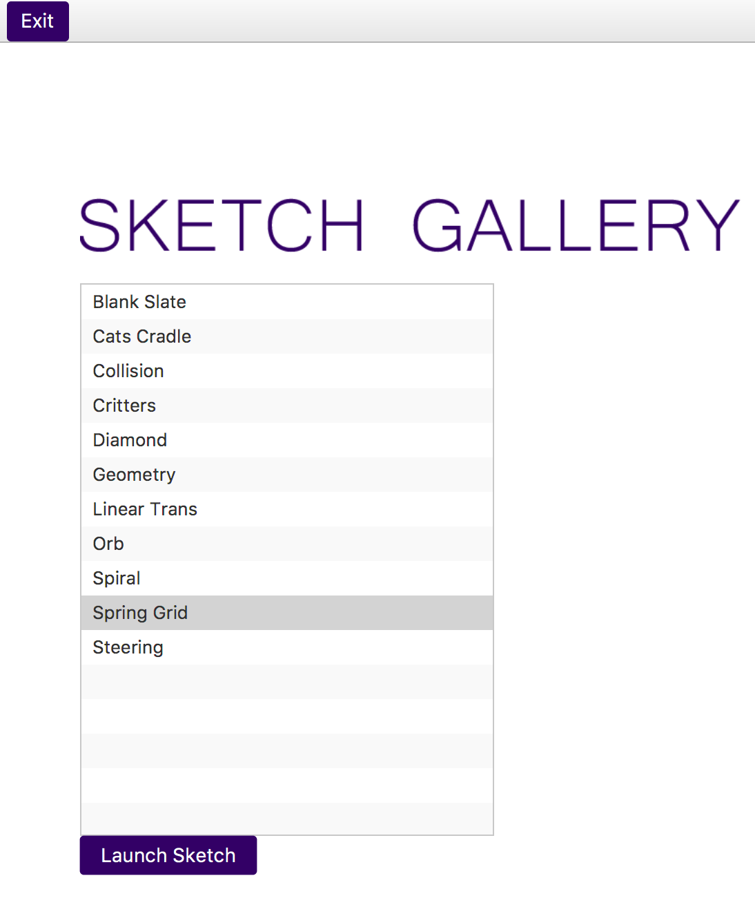

---
  ' 
   
  
  
  
   
 
Importing & Building
====================

Clone the project using `git clone https://github.com/AldousP/processing-sketches`

You can run the project from terminal using `gradle run`

Import into [IntelliJ](https://www.jetbrains.com/idea/) using Import Project > build.gradle and follow the steps to 
import as a Gradle project. Run using a Gradle run configuration which executes `run`.

Once built and run correctly, you will see the launcher which will allow you to run any of the sketches in the library.

Controls
====================

WASD Controls the camera position.

T Toggles the debug view.

-/+ Controls the camera zoom.

SHIFT Toggles camera information

[ & ] Controls jHat

{ & } Controls iHat

Left and Right Arrow Keys Rotate The Camera

ENTER Pauses the simulation

Links
====================
You can view video exports of the sketches I've made sprinkled throughout my 
<a href="https://www.instagram.com/p/BTzxbfVlofk/">Instagram. </a>

